- ### Установка windows
  - 
  - ### Установка metasploit2
  - 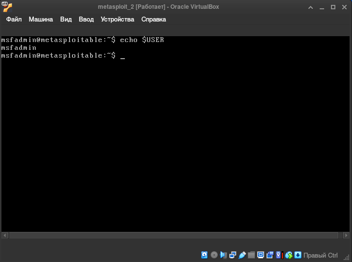
- ### Установка packer
  - 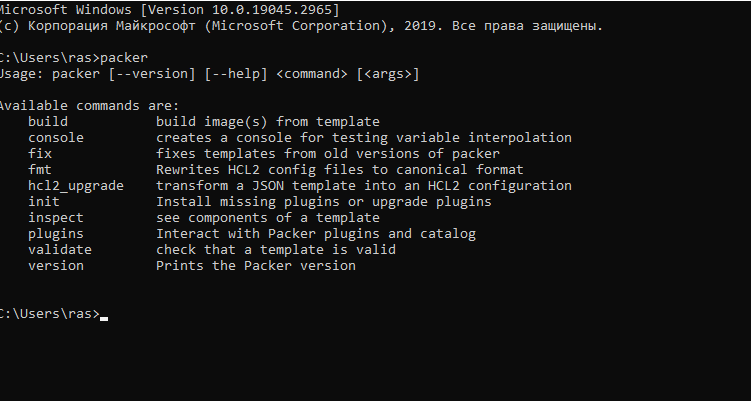
- ### Установка vagrant
  - 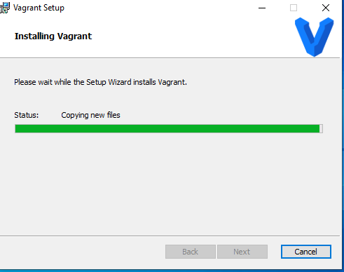
- ### Установка metasploit3
  - Неудалось доустановить metasploit3 при сборке с помощью скрипта с github. Произошла ошибка при установке плагинов vagrant
    - 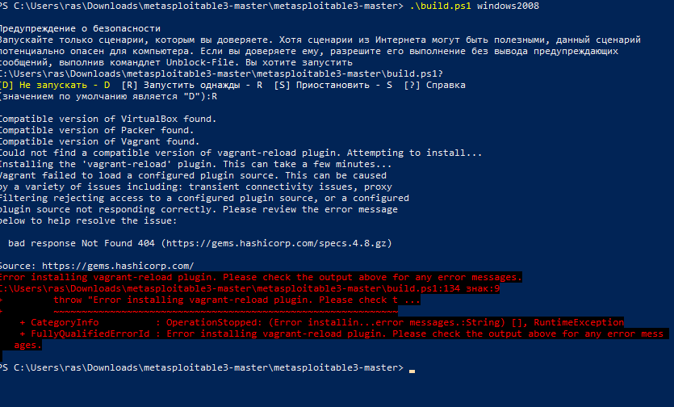
- Установке metasploit3 с помощью единого файла с расширением .ova тоже не удалась. Произошла ошибка при загрузке системы в virtualbox
    - 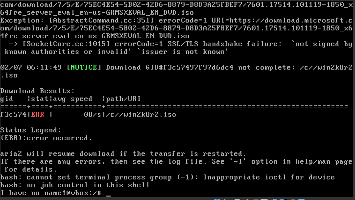
- ### Установка badstore
  - Успешная установка badstore в virtualbox
  - Просмотр сетевых настроек для подключения к веб-серверу
    - 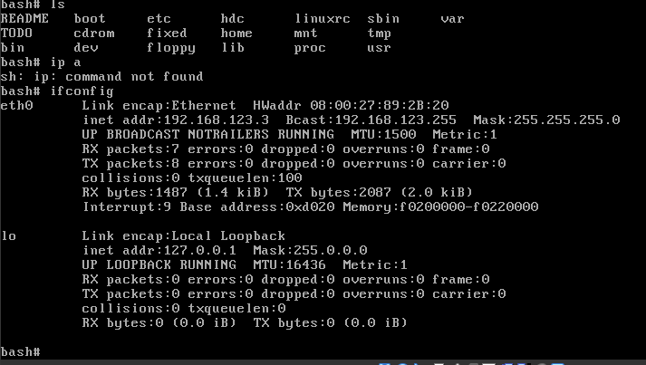
  - Подключение к серверу по ip адресу c хоста
    - 
- ### Установка kali linux
  - Успешная установка kali linux в virtualbox
  - Запуск веб-сервера apache и просмотр стартовой страницы через браузер
    - 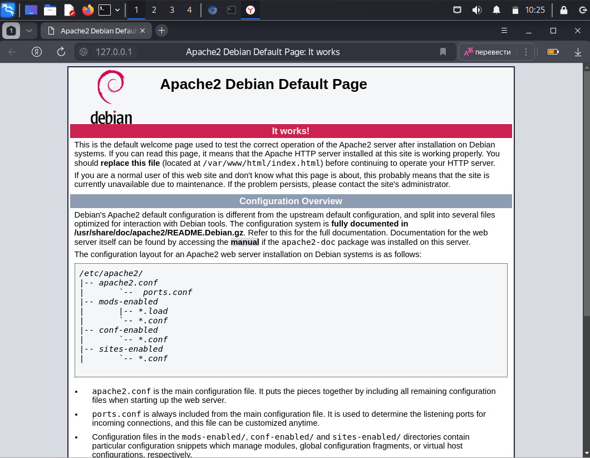
  - Подключение к базе данных mysql
    - 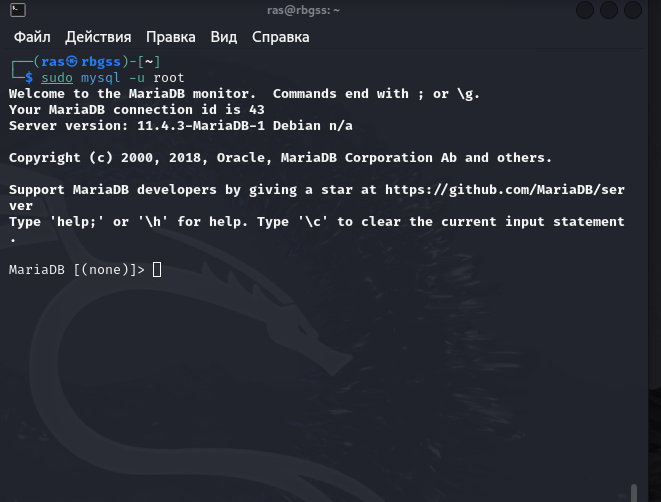
  - Подключение к kali linux по ssh
    - 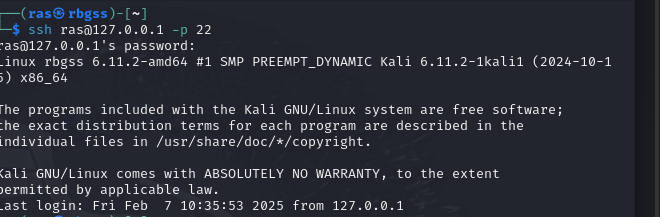
- ### Использование инструментов kali linux
  - Использование инструмента SET
    - 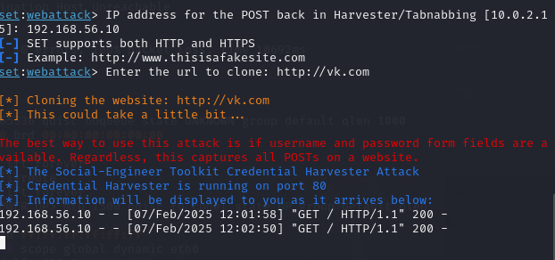
  - Использование инструмента OpenVAS
    - 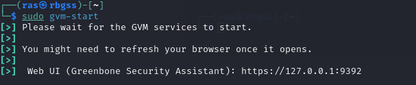