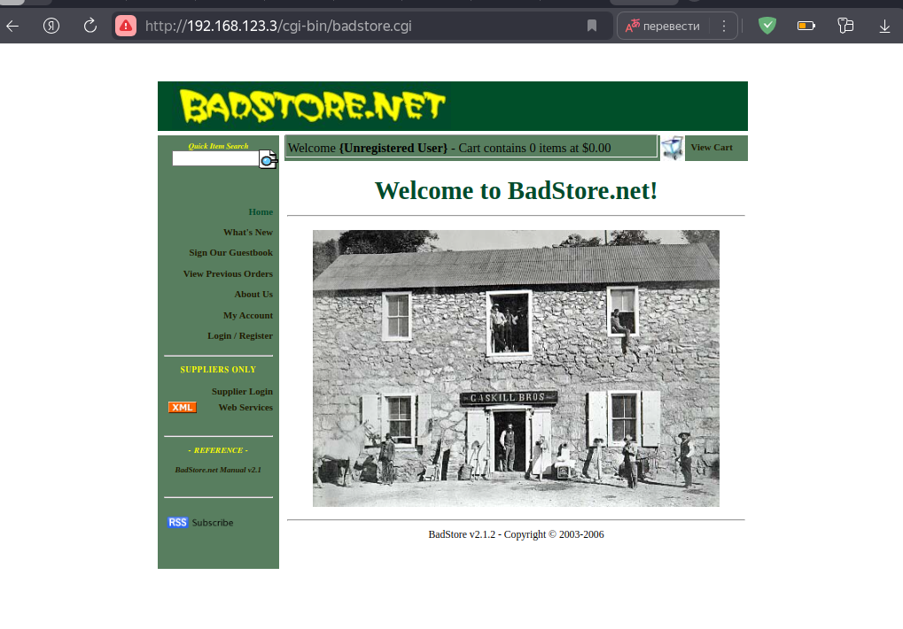
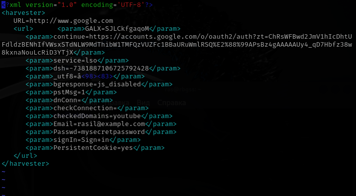

## Работу выполнил: Габдрахманов Расиль 06-151

- ## Установка windows
  - Скачан iso образ windows с официального сайта, создана виртуальная машина в virtualbox. Настроен windows для работы с браузером.
    - 

- ## Установка metasploitable 2
  - Загружены установочные файлы metaspoitable 2 с сайта по методичке. Создана виртуальная машина на основе существующего виртуального жесткого диска, скачанного с сайта. Выполнен вход в систему и вывено имя пользователя на экран.
    -   
    

- ## Установка packer
  - Установлен packer на windows, выведено на экран подтверждение работы программы
    - 

- ## Установка vagrant
  - Установлен успешно vagrant 
    - 

- ## Установка metasploitable 3
  - Загружен metasloitable 3 с github в папку. Открыта папка с помощью командной строки powershell в windows. Запущен скрипт сборки metasloitable 3. 
  Неудалась сборка metasloitable 3 с помощью скрипта. Произошла ошибка при установке плагинов vagrant
    - 
  
  - Так как сборка metasploitable 3 вручную не удалась, принято решение попробовать установить готовую сборку конфигурации virtualbox загрузив ее с github по ссылке в методичке. 
  Однако установка metasploitable 3 с помощью единого файла с расширением .ova тоже не удалась. Произошла ошибка при загрузке системы в virtualbox
    - 

- ## Установка badstore
  - Успешная установка badstore в virtualbox  
  Просмотр сетевых настроек для подключения к веб-серверу
    - 
  
  - Подключение по ip адресу c windows к badstore по внутренней сети в virtualbox
    - 

- ## Установка kali linux
  - Успешная установка kali linux в virtualbox  
  Запуск веб-сервера apache и просмотр стартовой страницы через браузер
    - 
  
  - Подключение к базе данных mysql
    - 
  
  - Подключение к kali linux по ssh
    - 

- ## Использование инструментов kali linux
  - ### Использование инструмента SET
  - Была выбрана атака с использованием поддельного скопированного сайта. Суть атаки такова: пользователь переходит по ссылке и попадает на сайт, который выглядит идентично какому-нибудь знакомому ему сайту. Далее пользователь вводит данные для аутентификации, которые будут отображаться в открытом ввиде в терминале машины, с которой производится атака  
  Вначале склонирован сайт google, в терминале виден запуск нашего сервера
    - 
  
  - Выполнен вход на сайт с машины windows, видно отображение сайта google. Были введены данные пользователя для аутентификации на сайте
    - 
  
  - После введения данных, они отражены в терминале машины, с которой запущен инструмент set. Данные отображаются в открытом виде, на экране виден логин и пароль пользователя.
    -    
    - 

  - Отчет сохранен в файл, который доступен для чтения в любое время
    - 

  - ### Использование инструмента OpenVAS
  - В данном задании выполнено сканирование сети на наличие уязвимостей с помощью инстумента OpenVas. Вначале установлены необходимые пакеты, далее достаточно долгое время происходило обновление конфигураций сканирования, во время обновления сканирование и выполнение задач выдавало ошибку. После обновления успешно просканирована подсеть, где находилась виртуальная машина windows.  
  Инструмент успешно обнаружил машину windows и правильно определил тип операционной системы
    - 
  
  - Также сохранен отчет в формате pdf, где отражены основные результаты сканирования. Получены два предупреждения - низкого и среднего уровня, результаты видны на экране
    -   
      